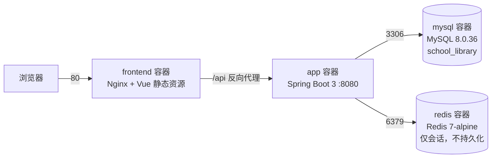
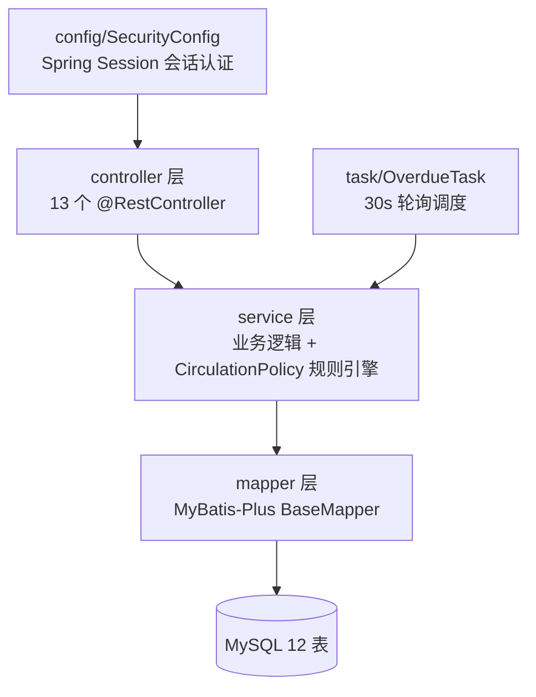
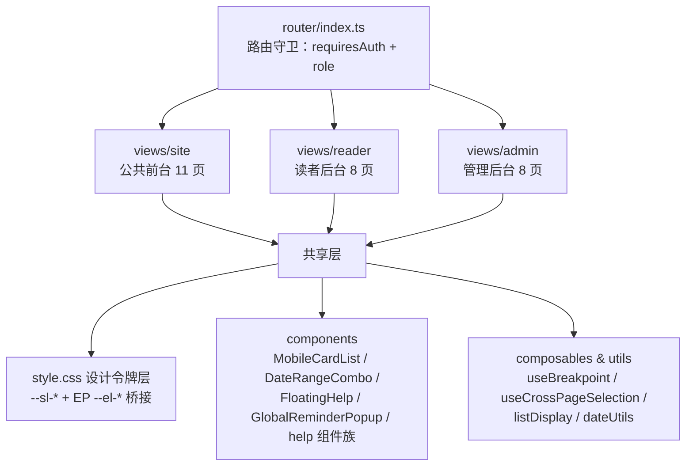
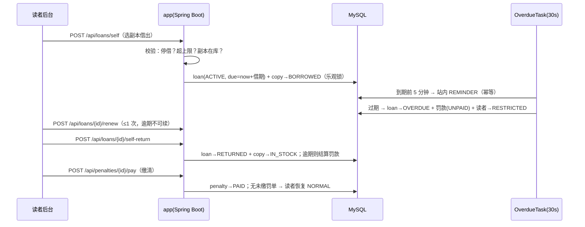

# 系统架构

> 技术栈：Vue 3.5 + Element Plus 2.14 / Spring Boot 3.2.5 + MyBatis-Plus / MySQL 8 + Redis 7 / Docker Compose
> 规格与变更历史见 [openspec/](../openspec/)；关键选型的取舍见 [docs/adr/](adr/)。

## 1. 容器部署拓扑

- 4 个服务定义于 [docker-compose.yml](../docker-compose.yml)；app 依赖 mysql/redis 的健康检查通过后才启动
- 数据卷仅 `mysql_data`（Redis 只存会话，关闭 RDB/AOF——会话丢了就重新登录，不值得落盘）
- 本机开发时四个组件都可独立跑（前端 vite :5173/5342，后端 :8080，MySQL/Redis 本机安装）

## 2. 应用分层（后端）

- 统一响应与异常：`{code, message}`，400/401/403/404/409 语义化错误码；未登录 `UNAUTHORIZED`、会话过期 `SESSION_EXPIRED`
- 接口文档由 Knife4j 运行时生成（`/doc.html`），维护成本为零

## 3. 前端三端模块结构（单 SPA）

- 三端同一 SPA、按角色路由守卫拆分：`/`（访客）、`/reader`（role=reader）、`/admin`（role=admin）
- 桌面/移动双形态：`useBreakpoint`（768px 断点，matchMedia 单例），重表格页「桌面 el-table / 手机 MobileCardList」双渲染
- 换肤体系：业务代码只引用 `--sl-*` 令牌，Element Plus 组件通过变量桥接自动跟随（换主题 ≈ 改一个文件，见 [ADR-004](adr/ADR-004-frontend-design-tokens.md)）

## 4. 核心数据流：借阅生命周期

完整规则与状态机见 [business-flows.md](business-flows.md)。

## 5. 技术选型一览

| 领域 | 选型 | 理由摘要 | ADR |
|---|---|---|---|
| 认证 | Spring Session + Redis（替代 JWT） | 需要服务端可吊销的会话与统一超时 | [ADR-001](adr/ADR-001-spring-session-over-jwt.md) |
| 馆藏模型 | 图书/副本两级（book_copy） | 流通实体是物理副本，条码可追溯 | [ADR-002](adr/ADR-002-copy-based-catalog.md) |
| 过程 | OpenSpec spec-driven | 需求→规格→任务的可审计变更链 | [ADR-003](adr/ADR-003-openspec-workflow.md) |
| 前端主题 | CSS 设计令牌 + EP 变量桥接 | 换肤收敛到单文件 | [ADR-004](adr/ADR-004-frontend-design-tokens.md) |
| 部署 | Docker Compose 单机四容器 | 课程级规模，无需编排平台 | [ADR-005](adr/ADR-005-docker-compose-topology.md) |
| ORM | MyBatis-Plus | SQL 可控 + 通用 CRUD 免写 | [ADR-006](adr/ADR-006-mybatis-plus.md) |
| 前端形态 | 三端同一 SPA | 共享组件/令牌/登录态，部署简单 | [ADR-007](adr/ADR-007-single-spa-three-surfaces.md) |

## 6. 监控与可观测性现状

如实记录：**当前没有监控告警体系**（无 Prometheus/Grafana/日志聚合）。现有手段：

- 健康探活：`GET /api/ping`（Docker 层面 mysql/redis 有 healthcheck，app 无）
- 结构化日志输出到 `logs/` 目录（本机运行时）
- 业务对账口径：管理后台首页的流通/罚款统计概览（`GET /api/stats/overview`）

若需接入监控，最小改造成本路径：暴露 Spring Boot Actuator health/metrics 端点 + Compose 外挂 Prometheus 容器。
