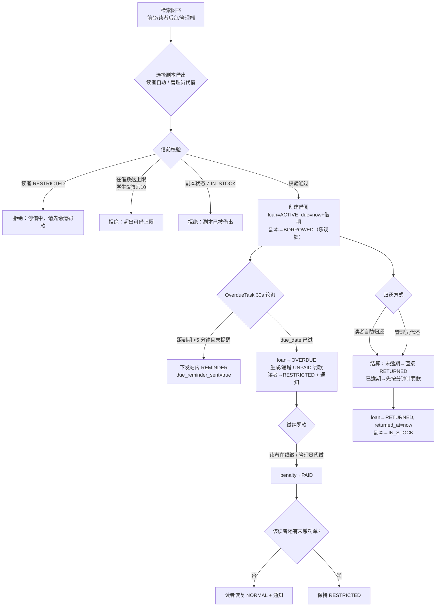
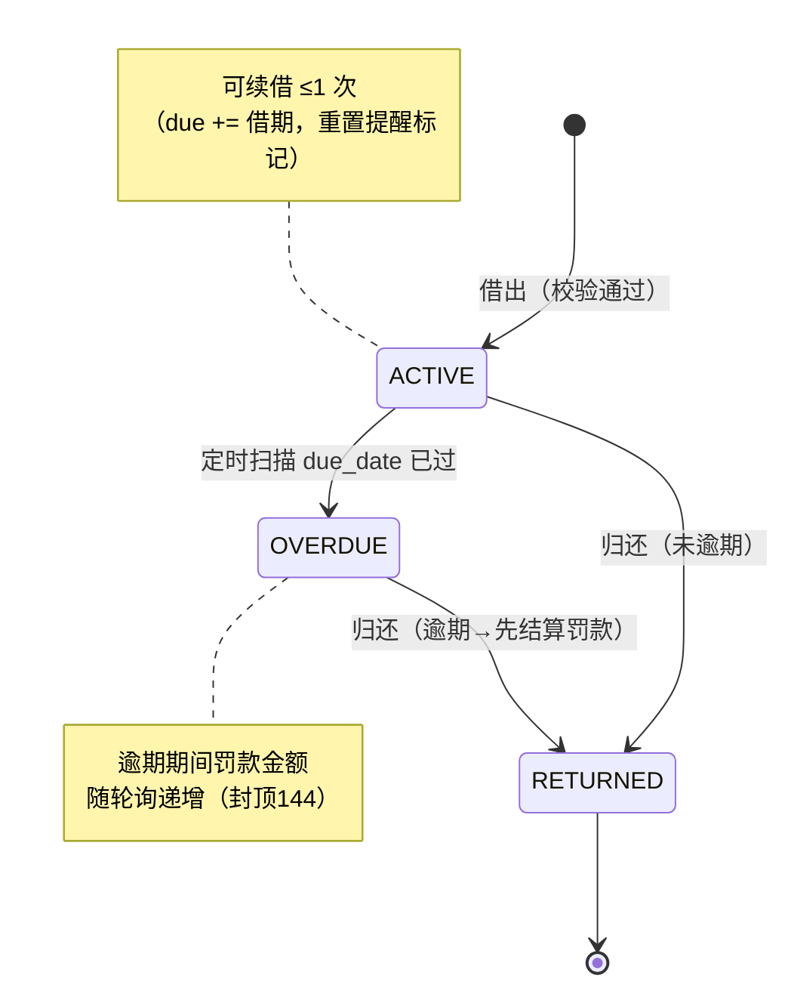
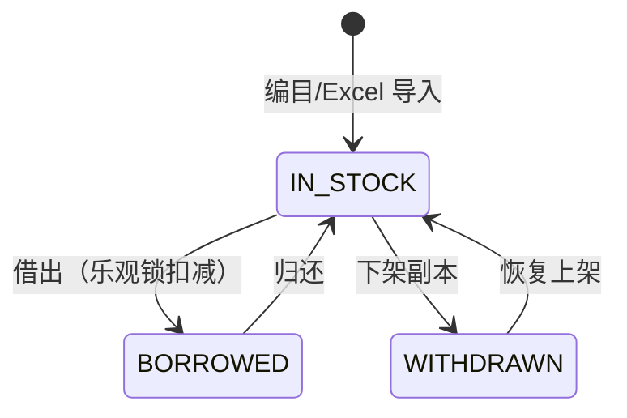
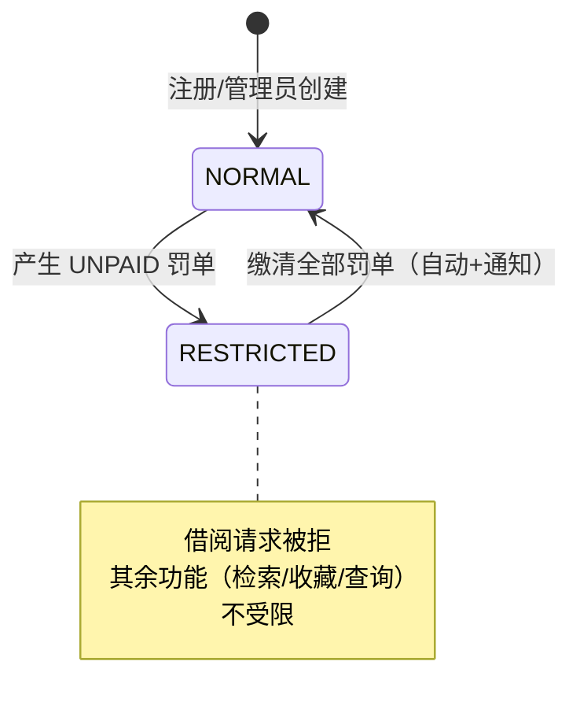
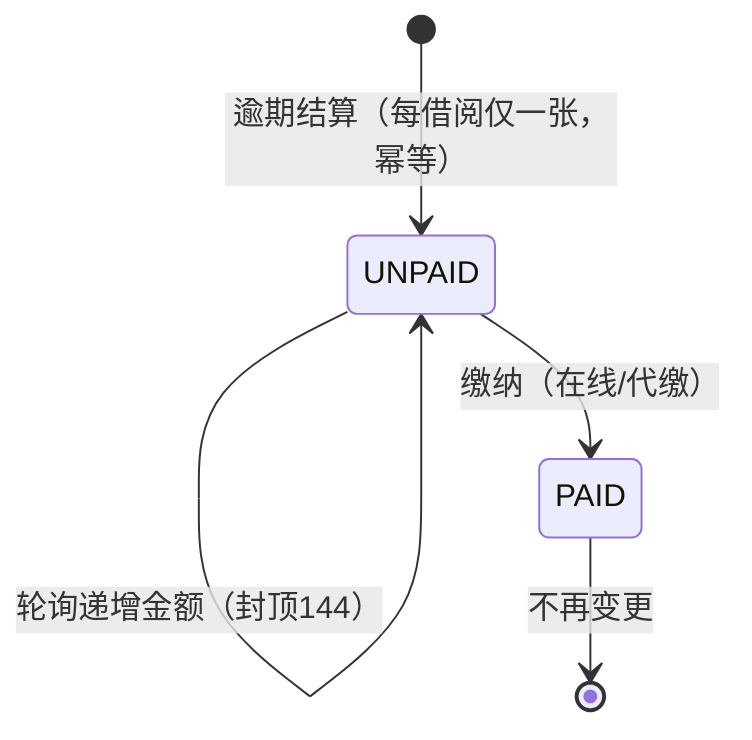
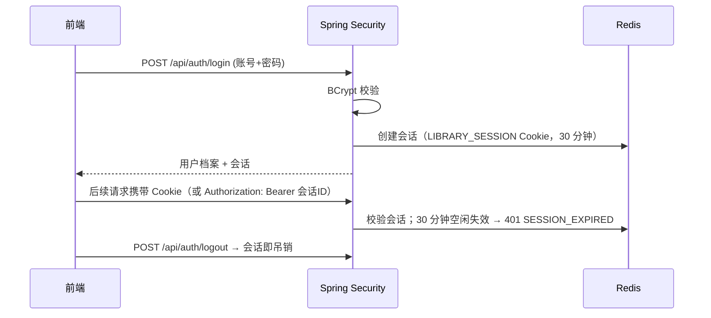

# 业务流程与状态机

> 本文档描述系统的核心业务域：**借阅流通**（检索 → 借出 → 续借/归还 → 逾期 → 罚款 → 停借/恢复），以及内容运营（公告/活动/帮助）的一笔带过说明。
> 参数来源：`application.yml` 的 `app.library.*` + `service/CirculationPolicy.java`，与 [database.md](database.md) 的数据字典一一对应。

## 1. 流通规则速查

| 规则 | 值 | 配置项/位置 |
|---|---|---|
| 借期 | 学生/教师均 **10 分钟**（演示口径） | `app.library.loan-minutes` |
| 可借数量 | 学生 **5** 本、教师 **10** 本（在借计入） | 代码内常量 |
| 续借 | 每本 **1 次**，续借顺延一个标准借期；**逾期不可续借** | `CirculationPolicy.maxRenewCount` |
| 逾期罚款 | **0.10 元/分钟**，不足 1 分钟按 1 分钟计 | `app.library.fine-per-minute` |
| 单本罚款封顶 | **144.00 元**（= 0.10 × 1440 分钟） | `app.library.max-fine-minutes` |
| 到期提醒 | 到期前 **5 分钟**下发一次站内 REMINDER（`due_reminder_sent` 幂等，续借后重置） | `app.library.reminder-minutes` |
| 逾期扫描 | 每 **30 秒**一轮（归还/续借时另有兜底结算） | `app.library.check-interval-ms` |
| 停借 | 存在 **UNPAID** 罚单 → 读者 RESTRICTED，借阅被拒 | `PenaltyServiceImpl` |
| 恢复 | 缴清全部罚单 → 自动恢复 NORMAL 并发通知 | 同上 |

## 2. 借阅主流程

## 3. 实体状态机

### 3.1 借阅 Loan

### 3.2 副本 book_copy

### 3.3 读者 reader（借阅资格）

### 3.4 罚款 penalty

## 4. 关键并发与幂等设计

- **并发借出**：同一副本两人同时点借阅 → `book_copy.version` 乐观锁，后提交者收到「副本已被借出」
- **罚款幂等**：`penalty.loan_id` 唯一约束 + 服务层"存在 UNPAID 且金额更大则更新"——定时任务与归还兜底双入口不会产生双份账单
- **提醒幂等**：`loan.due_reminder_sent` 标记保证到期提醒只发一次；续借后重置，续借后的新到期日仍会提醒
- **轮询 + 兜底**：逾期状态以 30s 定时任务为主；归还/续借接口内同步结算，保证即使调度延迟数据也一致

## 5. 认证与会话流程

会话三处超时配置必须一致（`app.session.timeout-minutes` / `spring.session.timeout` / Cookie Max-Age），详见 [security.md](security.md)。

## 6. 内容运营域（简述）

- **公告 announcement / 活动 activity**：管理员（或教师）发布、置顶、撤下；前台匿名可见，读者端公告/活动管理页复用同一套接口（学生仅读）
- **帮助反馈**：FAQ（管理员维护，前台悬浮窗与读者后台共用检索）→ 留言（游客可发，管理员回复）→ 实时对话（reader_id 会话 + 前端轮询，管理员侧"待处理"聚合）
- **通知 notification**：系统生成的私有站内消息（区别于公告），读者端时间线展示 + 未读数 + 一键已读
