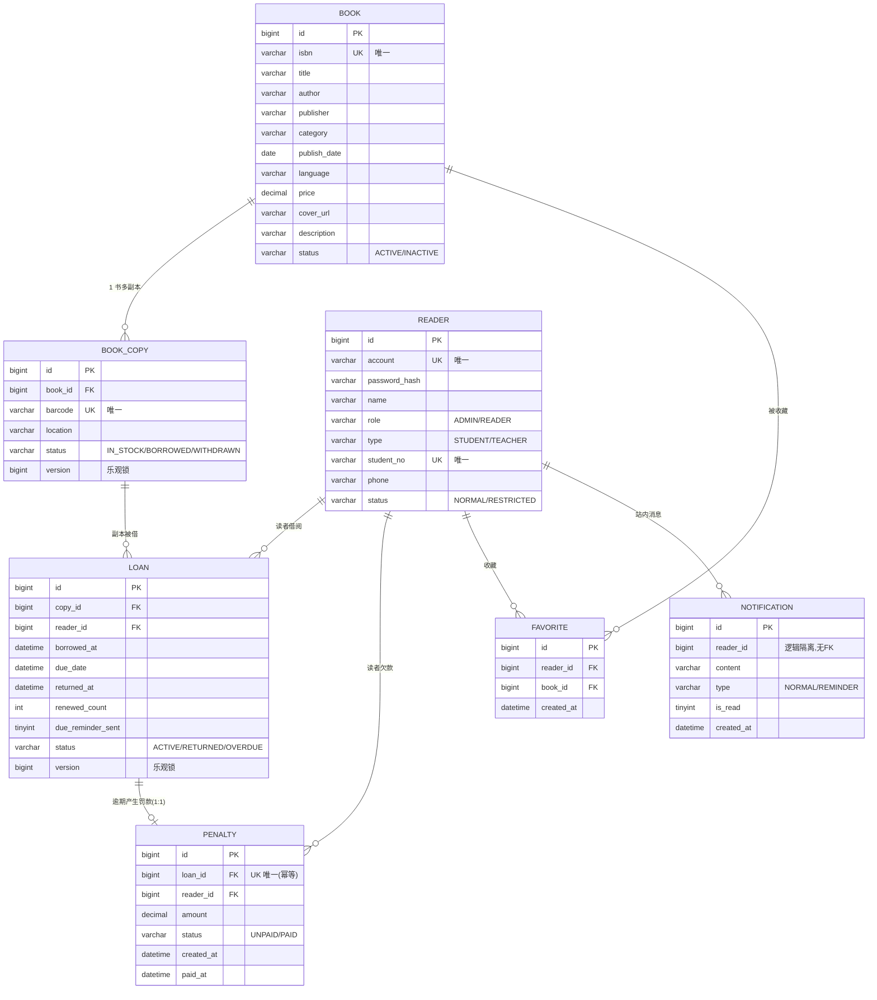

# 数据库设计

> MySQL 8.0，库名 `school_library`，utf8mb4 / utf8mb4_unicode_ci，全部 InnoDB。
> 建表脚本：[backend/src/main/resources/db/schema.sql](../backend/src/main/resources/db/schema.sql)（`CREATE TABLE IF NOT EXISTS` 幂等，后端启动时由 `SPRING_SQL_INIT_MODE=always` 自动执行）；增量脚本同目录 `upgrade-*.sql`。

## 1. ER 图

内容类辅助表（与业务主链无外键）：`announcement` 公告、`activity` 读者活动、`faq` 常见问题、`feedback_message` 留言反馈（游客可留言，reader_id 可空）、`chat_message` 在线咨询对话（前端轮询拉取）。

## 2. 表结构明细

### 2.1 book 书目

| 列 | 类型 | 约束 | 说明 |
|---|---|---|---|
| id | BIGINT | PK, AUTO_INCREMENT | |
| isbn | VARCHAR(20) | NOT NULL, **UK** `uk_book_isbn` | 国际标准书号，导入/新建按此去重更新 |
| title | VARCHAR(200) | NOT NULL | 书名 |
| author | VARCHAR(100) | | 作者（含译者，展示口径"作者 · 译者"） |
| publisher | VARCHAR(100) | | 出版社 |
| category | VARCHAR(50) | | 分类（检索侧栏聚合口径） |
| publish_date | DATE | | 出版日期 |
| language | VARCHAR(20) | | 语言 |
| price | DECIMAL(10,2) | | 定价（元） |
| cover_url | VARCHAR(255) | | 封面地址（http(s) 或站内 /uploads/） |
| description | VARCHAR(2000) | | 内容简介 |
| status | VARCHAR(20) | NOT NULL DEFAULT 'ACTIVE' | 见数据字典 |

### 2.2 book_copy 副本（可借实体）

| 列 | 类型 | 约束 | 说明 |
|---|---|---|---|
| id | BIGINT | PK | |
| book_id | BIGINT | FK→book.id（`fk_copy_book`），索引 `idx_copy_book` | 所属书目 |
| barcode | VARCHAR(50) | NOT NULL, **UK** `uk_copy_barcode` | 馆藏条形码，借阅凭据 |
| location | VARCHAR(100) | | 馆藏位置 |
| status | VARCHAR(20) | NOT NULL DEFAULT 'IN_STOCK' | 见数据字典 |
| version | BIGINT | NOT NULL DEFAULT 0 | **乐观锁**（并发借出防超卖） |

### 2.3 reader 读者（含管理员）

| 列 | 类型 | 约束 | 说明 |
|---|---|---|---|
| id | BIGINT | PK | |
| account | VARCHAR(50) | NOT NULL, **UK** `uk_reader_account` | 登录账号 |
| password_hash | VARCHAR(100) | NOT NULL | BCrypt 散列 |
| name | VARCHAR(50) | NOT NULL | 姓名 |
| role | VARCHAR(20) | NOT NULL DEFAULT 'READER' | ADMIN/READER（管理员账号也存此表） |
| type | VARCHAR(20) | NOT NULL DEFAULT 'STUDENT' | STUDENT/TEACHER（决定可借数量） |
| student_no | VARCHAR(30) | NOT NULL, **UK** `uk_reader_student_no` | 学号/工号 |
| phone | VARCHAR(30) | | 手机号 |
| status | VARCHAR(20) | NOT NULL DEFAULT 'NORMAL' | NORMAL/RESTRICTED（停借） |

### 2.4 loan 借阅记录

| 列 | 类型 | 约束 | 说明 |
|---|---|---|---|
| id | BIGINT | PK | |
| copy_id | BIGINT | FK→book_copy.id（`fk_loan_copy`），索引 `idx_loan_copy` | 借出的副本 |
| reader_id | BIGINT | FK→reader.id（`fk_loan_reader`），索引 `idx_loan_reader` | 借阅读者 |
| borrowed_at | DATETIME | NOT NULL | 借出时间 |
| due_date | DATETIME | NOT NULL | 应还时间（借期以分钟计，必须精确到时刻） |
| returned_at | DATETIME | | 归还时间（未还为 NULL） |
| renewed_count | INT | NOT NULL DEFAULT 0 | 续借次数（上限 1） |
| due_reminder_sent | TINYINT(1) | NOT NULL DEFAULT 0 | 到期提醒幂等标记（续借时重置） |
| status | VARCHAR(20) | NOT NULL DEFAULT 'ACTIVE' | 见数据字典 |
| version | BIGINT | NOT NULL DEFAULT 0 | 乐观锁 |
| 索引 | | `idx_loan_status_due(status, due_date)` | 覆盖逾期扫描任务的主查询 |

### 2.5 penalty 罚款账单

| 列 | 类型 | 约束 | 说明 |
|---|---|---|---|
| id | BIGINT | PK | |
| loan_id | BIGINT | FK→loan.id（`fk_penalty_loan`），**UK** `uk_penalty_loan` | **一笔借阅至多一张罚单**——定时任务与归还兜底都靠它幂等 |
| reader_id | BIGINT | FK→reader.id（`fk_penalty_reader`），索引 `idx_penalty_reader_status` | 欠款读者 |
| amount | DECIMAL(10,2) | NOT NULL | 金额（未缴期间随轮询递增，封顶 144.00） |
| status | VARCHAR(20) | NOT NULL DEFAULT 'UNPAID' | UNPAID/PAID（PAID 后不再更新金额） |
| created_at / paid_at | DATETIME | | 生成/缴纳时间 |

### 2.6 favorite 收藏

`reader_id` + `book_id` 联合唯一（`uk_favorite_reader_book`）——同一读者对同一书至多一条；索引 `idx_favorite_reader_created`。

### 2.7 notification 站内消息

按 `reader_id` 逻辑隔离（无外键），索引 `idx_notification_reader(reader_id, is_read)`；`type=NORMAL` 普通通知（逾期结算/罚款/恢复资格），`type=REMINDER` 到期提醒（读者端弹窗只弹这一类）。

### 2.8 内容表

| 表 | 用途 | 关键列/约束 |
|---|---|---|
| announcement | 公共公告 | `pinned`+`published_at` 联合索引（置顶优先） |
| activity | 读者活动 | `tag` 类别标签（校级/培训/沙龙/活动/竞赛），置顶索引同上 |
| faq | FAQ 知识库 | `enabled` 停用后前台不可见 |
| feedback_message | 留言反馈 | `reader_id` 可空（游客），`status=UNREPLIED/REPLIED`，含回复人/回复时间 |
| chat_message | 在线咨询 | `sender_role=READER/ADMIN`，索引 `idx_chat_reader(reader_id, id)` |

## 3. 索引与约束设计要点

- **唯一约束即业务幂等**：`uk_penalty_loan`（罚款不重复生成）、`uk_copy_barcode`（条码即借阅凭据）、`uk_book_isbn`（导入按 ISBN 更新）、`uk_favorite_reader_book`（收藏幂等）
- **复合索引对准查询**：`idx_loan_status_due` 服务逾期扫描（每 30s，按 status+due_date 扫描）、`idx_feedback_status` 服务管理端"待回复"列表、两个 `pinned, created_at` 服务置顶排序列表
- **乐观锁**：`book_copy.version` 与 `loan.version`——并发自助借出同一副本时后拒绝一方，防止超借
- **外键**：业务主链（copy/loan/penalty/favorite）保留外键约束；消息/内容表用逻辑关联不建 FK
- **分库分表**：无。课程级数据量（单库 12 表），不做分片；如未来演进，拆分候选是 `loan/penalty`（历史归档）与 `chat_message`（增长最快）

## 4. SQL 规范（本仓库约定）

- 建表统一 `CREATE TABLE IF NOT EXISTS` + 幂等可重跑；增量变更写 `db/upgrade-<topic>.sql`（现有 6 个），**禁止修改已发布的 upgrade 脚本**，回滚口径见 [rollback.md](rollback.md)
- 状态列一律 `VARCHAR(20)` 存枚举名字符串（不用数字码），可读性优先
- 时间列 `DATETIME`，业务时区 Asia/Shanghai（MySQL 容器已设 TZ）
- 金额 `DECIMAL(10,2)`，禁止 float/double

## 5. 数据字典（枚举与编码）

| 字典 | 取值 | 含义 | 定义位置 |
|---|---|---|---|
| book.status | `ACTIVE` | 在架可借 | entity/BookStatus |
| | `INACTIVE` | 已下架（不可新增借阅） | |
| book_copy.status | `IN_STOCK` | 在库可借 | entity/CopyStatus |
| | `BORROWED` | 已借出 | |
| | `WITHDRAWN` | 已下架（撤销） | |
| loan.status | `ACTIVE` | 在借 | entity/LoanStatus |
| | `RETURNED` | 已归还 | |
| | `OVERDUE` | 逾期未还 | |
| reader.role | `ADMIN` | 图书管理员 | entity/UserRole |
| | `READER` | 读者 | |
| reader.type | `STUDENT` | 学生（可借 5 本） | entity/ReaderType |
| | `TEACHER` | 教师（可借 10 本） | |
| reader.status | `NORMAL` | 正常可借 | entity/ReaderStatus |
| | `RESTRICTED` | 停借（有未缴罚单） | |
| penalty.status | `UNPAID` | 未缴 | entity/PenaltyStatus |
| | `PAID` | 已缴 | |
| notification.type | `NORMAL` | 普通站内消息（逾期结算/罚款/恢复资格） | entity/Notification 常量 |
| | `REMINDER` | 到期提醒（读者端弹窗类） | |
| feedback_message.status | `UNREPLIED` / `REPLIED` | 待回复/已回复 | schema 默认值 |
| chat_message.sender_role | `READER` / `ADMIN` | 发言方角色 | schema 注释 |
| activity.tag | 校级/培训/沙龙/活动/竞赛 | 活动类别标签 | schema 注释 |

> 会话 Cookie 名 `LIBRARY_SESSION`（Redis 会话，非业务表）。
