# 用户操作手册

> 面向系统使用者：**访客**（无需登录）、**读者**（学生/教师账号）、**管理员**。截图基于「暖木书斋」主题，桌面 1280×800。
> 快速入口：本机开发 <http://localhost:5173>（或 5342）/ Docker 部署同端口；默认账号见文末。

## 一、访客 · 公共前台

无需登录即可使用。导航：首页 / 本馆概况 / 读者服务 / 读者活动。

### 1.1 首页与馆藏检索

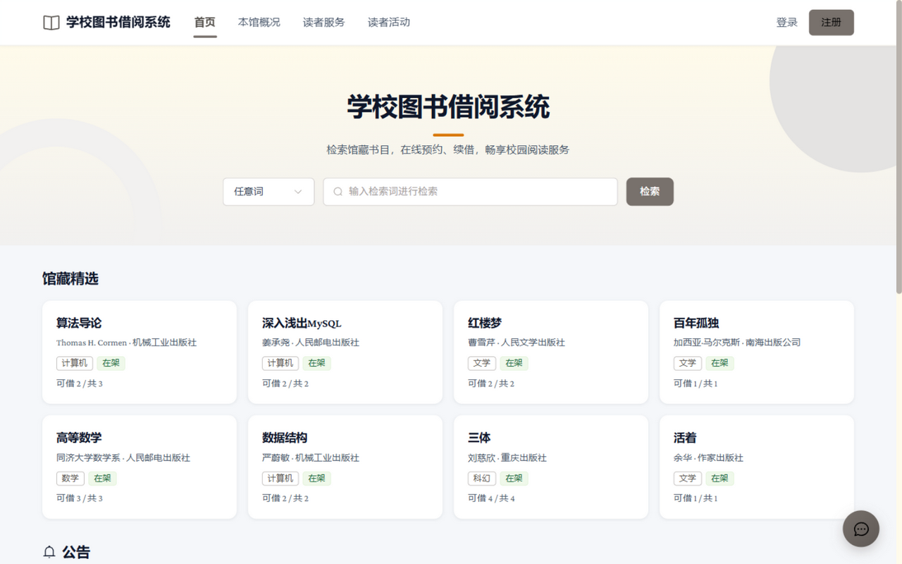

- 首页顶部检索框：先选检索字段（任意词/书名/作者/ISBN/出版社/主题），输入关键词后点「检索」
- 首页下方为馆藏精选卡片与最新公告（置顶优先）
- 右下角悬浮窗可随时打开帮助检索

### 1.2 检索结果与筛选

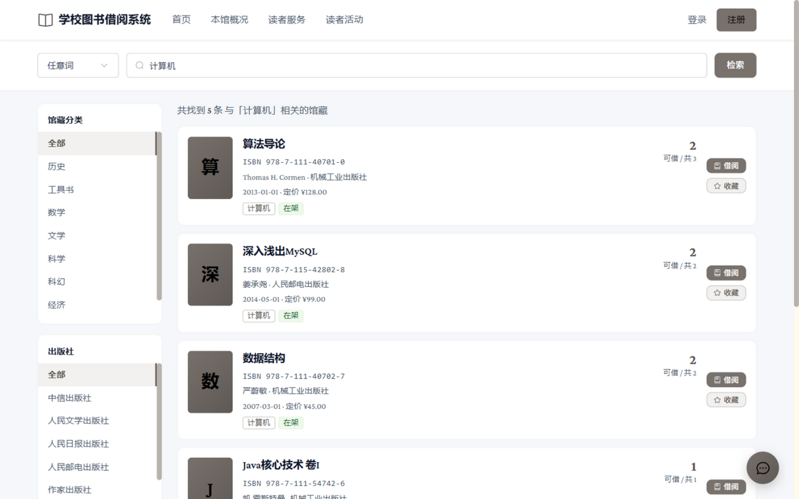

- 左侧按**馆藏分类 / 出版社**聚合筛选，与关键词叠加过滤
- 每条结果显示 ISBN、作者、出版社、定价与「可借 x / 共 y」；未登录点「借阅」会引导先登录（`?redirect=` 回跳）

### 1.3 图书详情

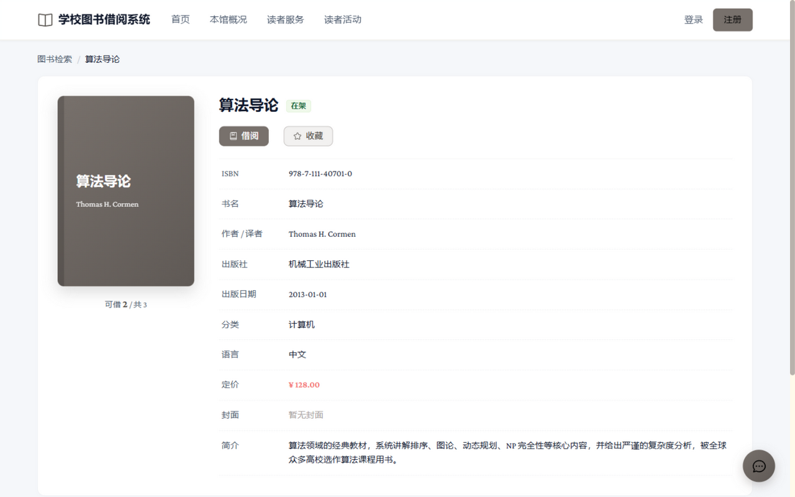

- 左侧封面（无封面时显示书名占位），右侧 10 行完整信息（ISBN/书名/作者译者/出版社/出版日期/分类/语言/定价/封面/简介）
- 面包屑显示来源页与书名；「借阅」「收藏」需登录

### 1.4 读者服务

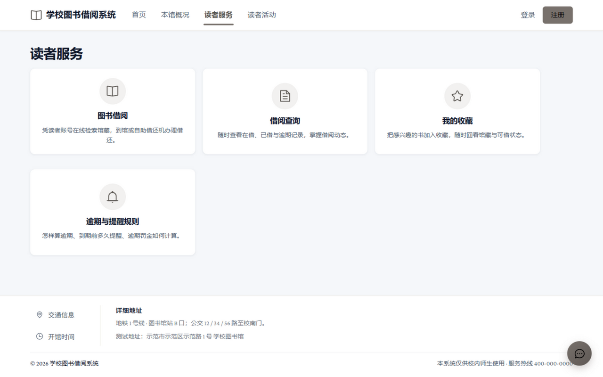

- 四张服务卡片：图书借阅、借阅查询、我的收藏、逾期与提醒规则（逾期罚款 0.10 元/分钟、单本封顶 144 元、到期前 5 分钟站内提醒等规则说明）

### 1.5 读者活动

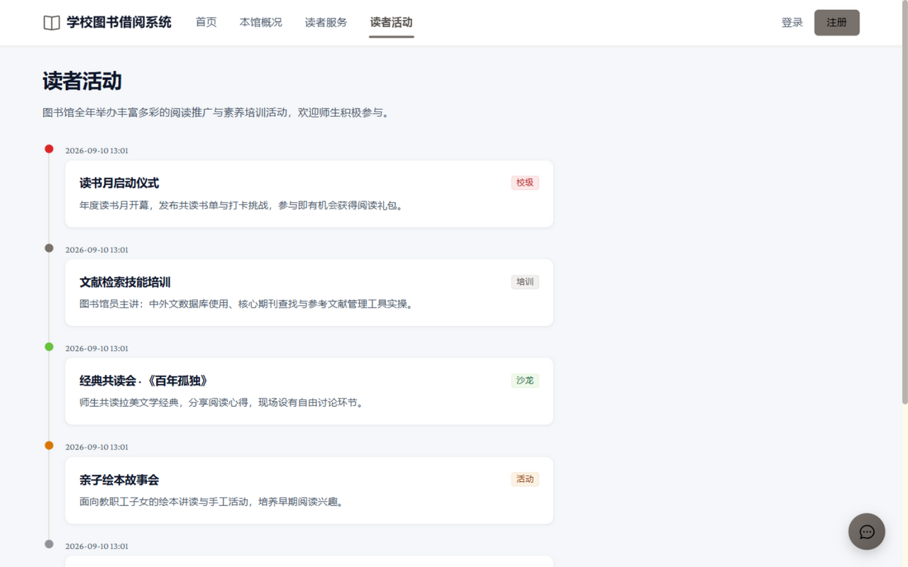

- 时间线形式展示馆内活动（校级/培训/沙龙/活动/竞赛标签，置顶优先）
- 「本馆概况」子导航含：本馆简介 / 规章制度 / 楼层分布

### 1.6 注册与登录

- 导航「注册」自助开通读者账号（即注即用）；已有账号点「登录」
- 忘记密码请联系管理员重置（见管理员手册 3.2）

## 二、读者 · 自助后台

登录学生/教师账号后进入 `/reader`（左侧菜单或移动端底部 Tab）。全局：右上角头像菜单可修改密码；空闲 30 分钟自动登出（提前有预警提示）。

### 2.1 读者首页（通知中心）

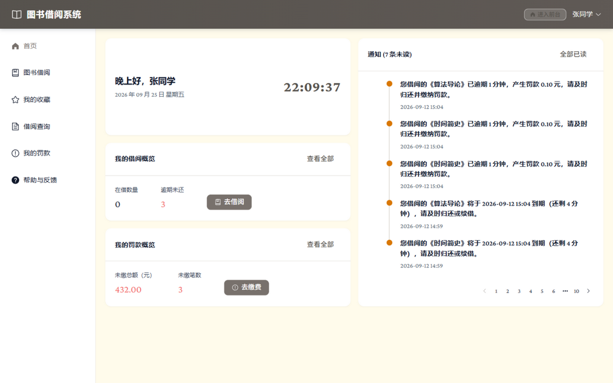

- 时间线展示站内通知（逾期结算、罚款、到期提醒、资格恢复），右上角显示未读数
- 卡片区概览：在借数量 / 逾期未还、未缴总额 / 笔数；「去借阅」「去缴费」快捷入口；「全部已读」一键清未读

### 2.2 自助借阅

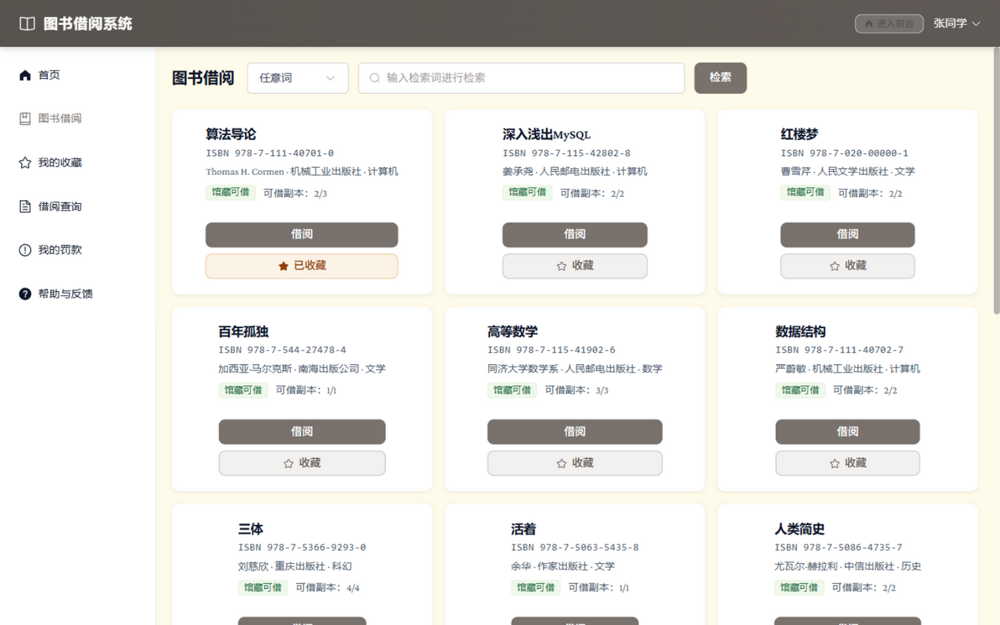

- 检索图书 → 卡片上直接点「借阅」→ 弹出副本选择框（按条形码）→ 确认借出
- 借出校验失败会给出明确原因：停借中 / 超出可借上限（学生 5 本、教师 10 本）/ 副本已被借出
- 点「收藏」即可收藏/取消（已收藏带 ★ 标记）

### 2.3 我的借阅与续借

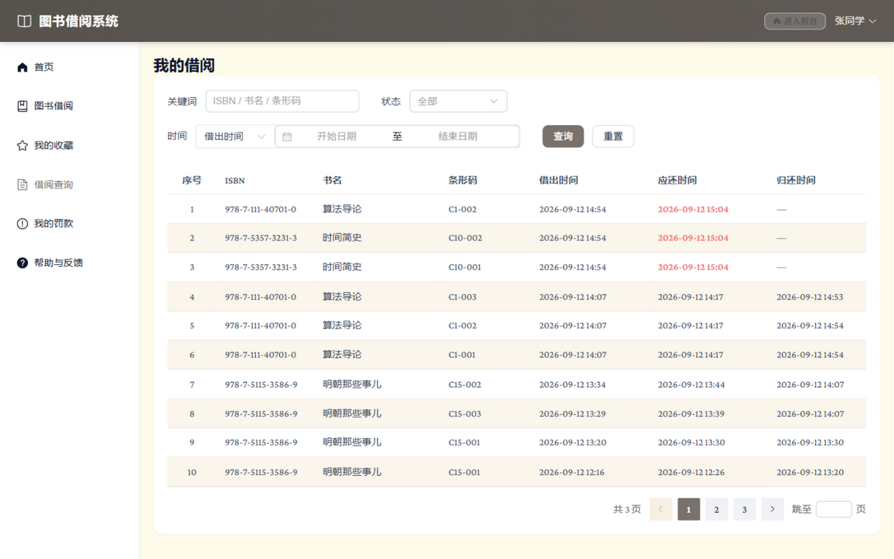

- 「在借」页签：显示应还时间（临期/逾期红色高亮），可直接「续借」（每本限 1 次，顺延一个借期；**逾期后不可续借**）与「归还」
- 「历史」页签：含已归还记录；支持按关键词/状态/借出或归还时间区间筛选（分页）

### 2.4 我的罚款

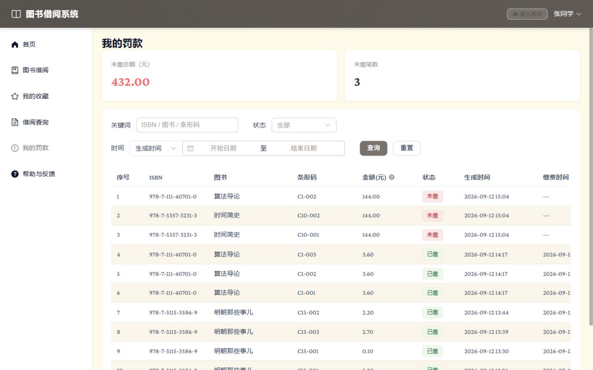

- 顶部概览未缴总额与笔数；列表区分「未缴/已缴」，未缴行可在线缴纳
- 逾期罚款规则：0.10 元/分钟，不足 1 分钟按 1 分钟，单本封顶 144.00 元
- **缴清全部罚单后借阅资格自动恢复**（会收到恢复通知）

### 2.5 帮助与反馈

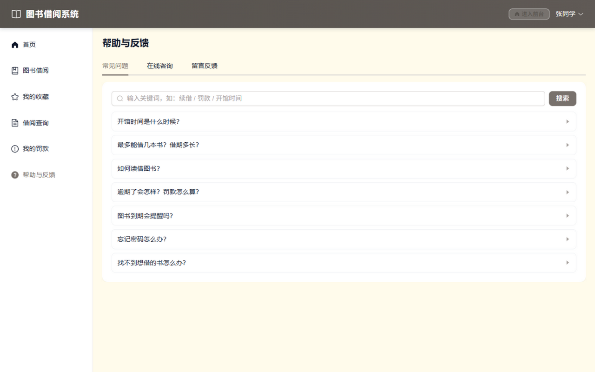

- 常见问题：关键词检索 FAQ（开馆时间/借期/续借/罚款/提醒/密码等）
- 在线咨询：与馆员实时对话（轮询刷新）；留言反馈：提交后等管理员回复

## 三、管理员 · 管理后台

登录 admin1 后进入 `/admin`。

### 3.1 管理首页

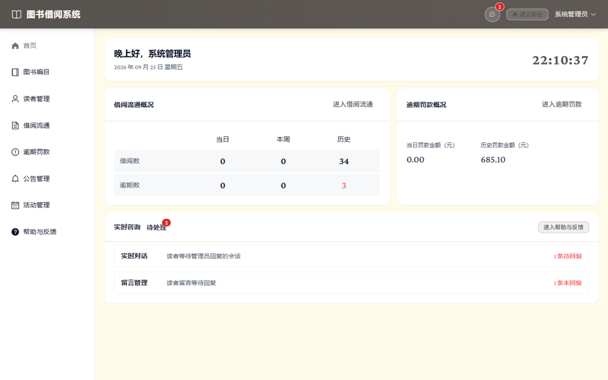

- 借阅流通概况（当日/本周/历史借阅数与逾期数）、逾期罚款概况（当日/历史金额）
- 实时咨询与留言的待处理聚合入口（有新咨询时侧栏图标带角标）

### 3.2 图书编目

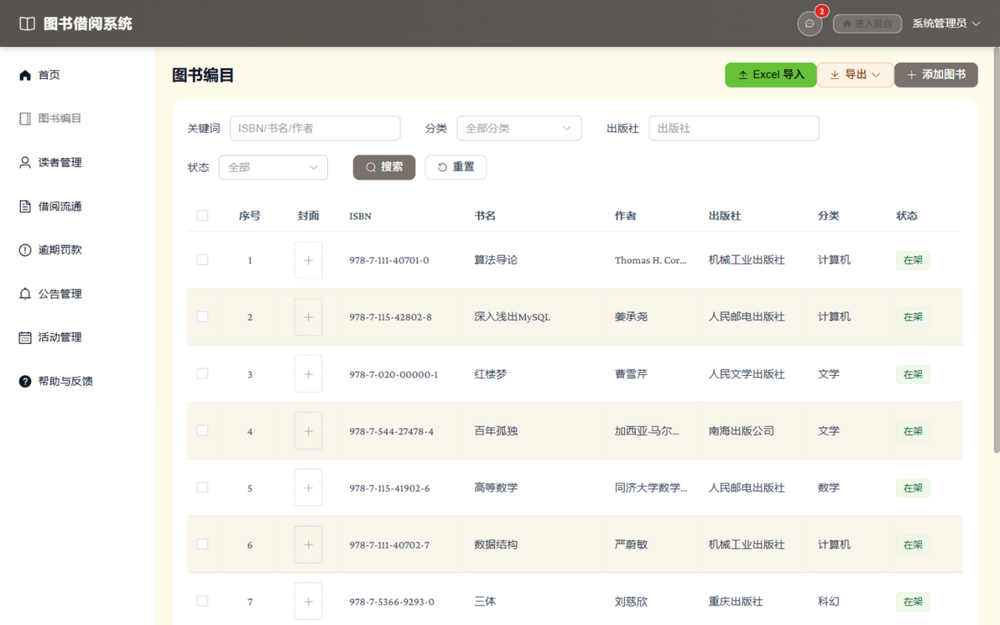

- 新增/编辑图书（ISBN 唯一）；封面可填 http(s) 链接或站内 /uploads/ 地址
- 副本管理：每本图书下的物理副本（条形码唯一）逐一登记；「详情」查看副本列表
- 上下架：单本或勾选批量（在架/下架状态影响是否可借）
- **Excel 批量导入**：先「下载模板」，按列填写（ISBN/书名/作者/出版社/分类，图片链接可选），ISBN 已存在的行为更新；支持导出
- 检索：关键词 + 分类 + 出版社 + 状态组合筛选

### 3.3 借阅流通

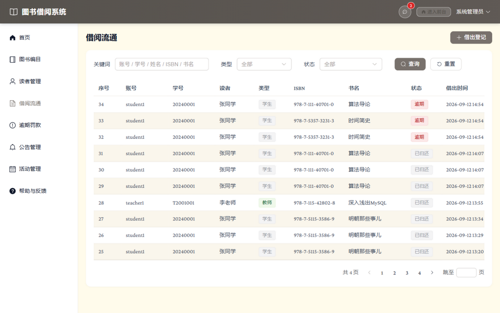

- 「借出登记」：按读者账号 + 副本条码**代借**（适合柜台场景，校验规则与自助借阅一致）
- 列表按读者/类型/状态筛选；每行可代还、续借；逾期行红色标记

### 3.4 逾期罚款

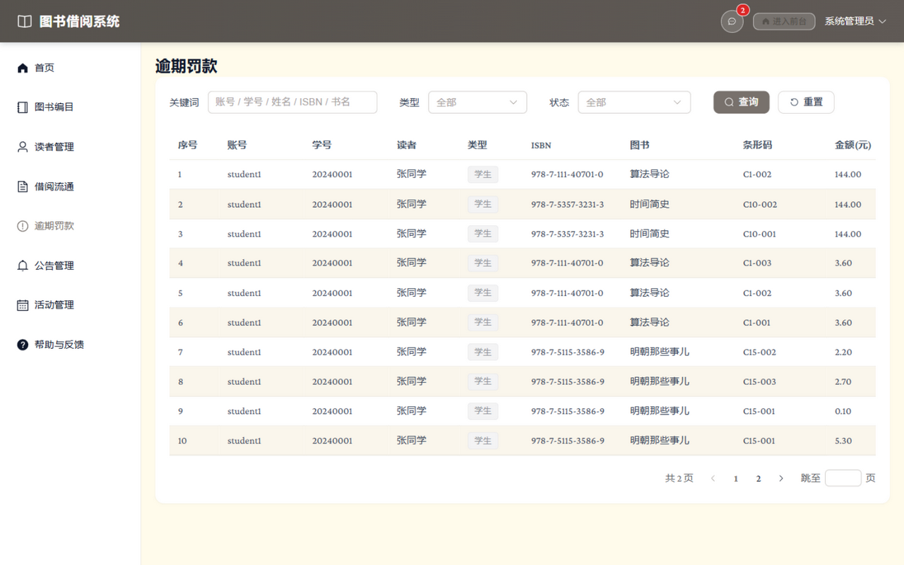

- 全量罚单查询（读者/类型/状态筛选）；未缴罚单可「标记已缴」（代缴，替读者恢复借阅资格）
- 罚款自动生成：读者逾期后由系统定时结算，无需手工建单

### 3.5 帮助与反馈管理

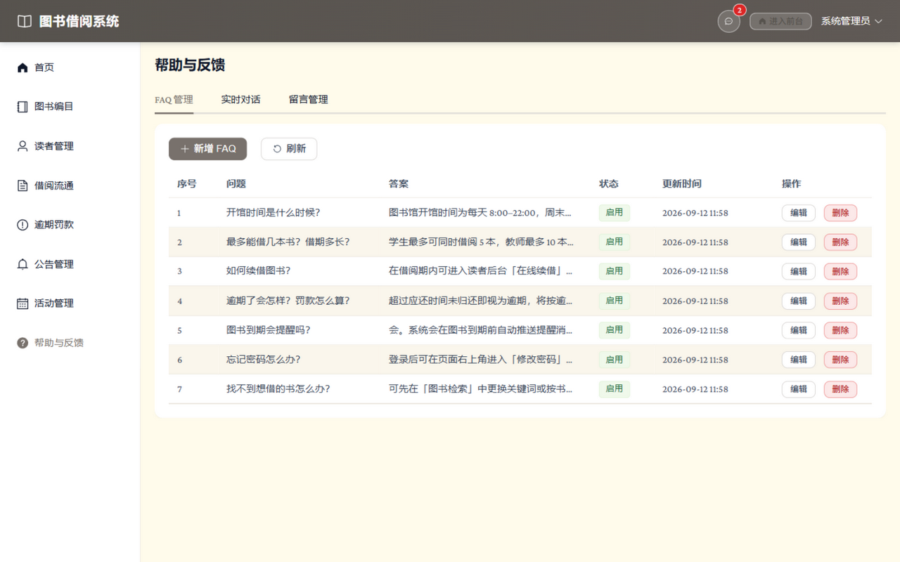

- FAQ 管理：新增/编辑/停用/删除（停用后前台检索不到）
- 实时对话：查看读者会话并回复（待处理角标提示）
- 留言管理：回复游客/读者留言（回复后状态变为已回复）

> 公告管理与活动管理：三端中读者-教师与管理员均可进入（学生只读），支持置顶与富内容编辑，此处不再配图。

## 四、默认账号

| 账号 | 密码 | 角色 | 说明 |
|---|---|---|---|
| admin1 | pass123 | 管理员 | 全部管理权限 |
| student1 | pass123 | 学生读者 | 可借 5 本（张同学，演示数据含逾期/罚款） |
| teacher1 | pass123 | 教师读者 | 可借 10 本（李老师） |

## 五、常见使用问题

| 问题 | 处理 |
|---|---|
| 点借阅提示「停借中」 | 有未缴罚款，到「我的罚款」缴清后自动恢复 |
| 续借按钮不可用 | 该书已续借过 1 次或已逾期 |
| 没收到到期提醒 | 提醒在到期前 5 分钟内发一次；已发过的不再重复 |
| 忘记密码 | 管理员在「读者管理 → 重置密码」处理；用户登录后右上角可自行改密 |
| 手机端界面 | 直接用手机浏览器访问，系统自动切换卡片视图与底部导航 |
